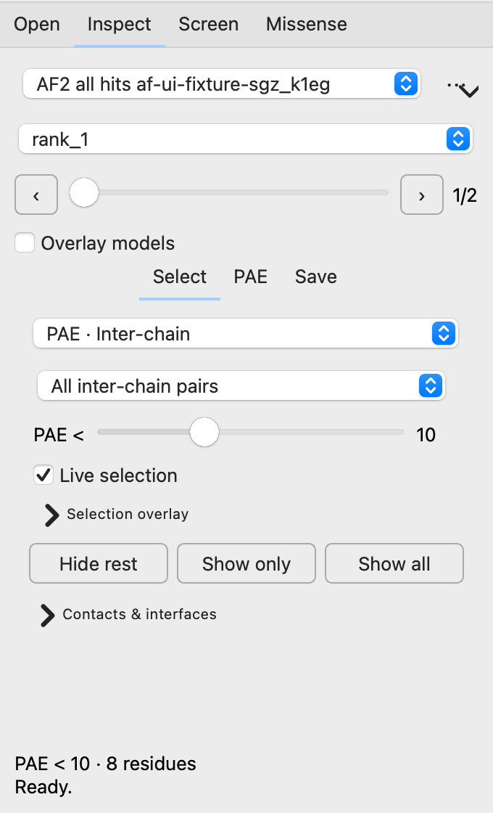
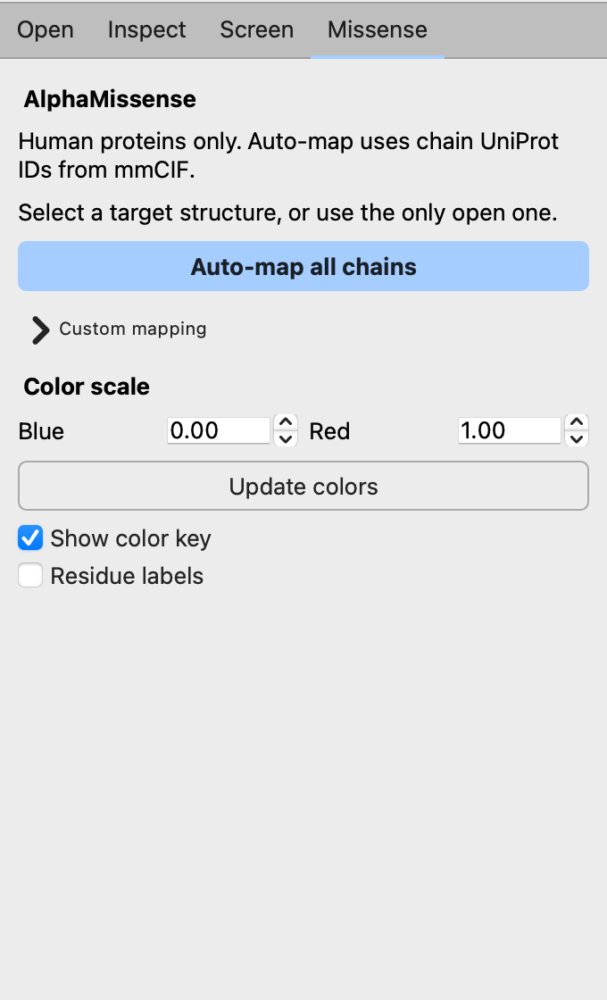
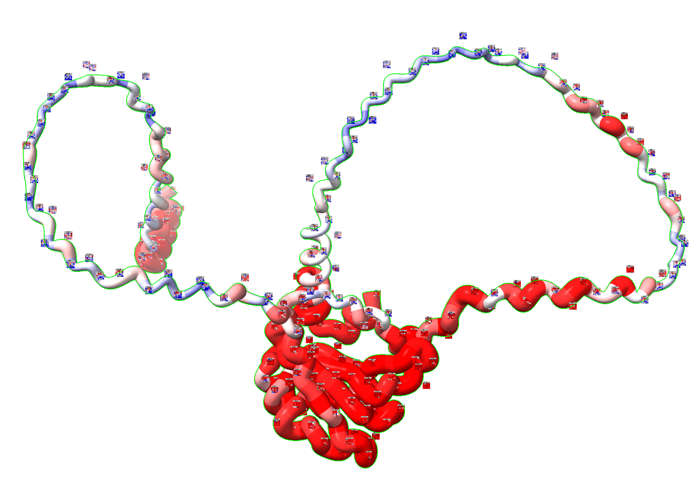

# ChimeraX AF Prediction Analysis Toolbars

This bundle facilitates the analysis of AlphaFold and AlphaFold-Multimer predictions by processing input folders and automatically associating PAE plots with predicted structures. Selection via numeric cutoffs on PAE or pLDDT values helps focus inspection on confident model regions, predicted interfaces, and lower-confidence regions that need care.

## Compact AF workspace (1.4)

All toolbar actions share one dockable **AF Workspace**. Switch between **Open**,
**Inspect**, **Screen**, and **Missense** without spawning extra control windows.
The PAE plot opens in a separate window by default for side-by-side inspection.
Toolbar shortcuts select the relevant page and mode; use **Browse…** to choose a
folder. Closing the workspace hides it, so reopening it keeps your loaded runs.

The interface uses the ChimeraX font and palette, short labels, tooltips, and
collapsible advanced controls. Long names do not widen the dock. Forms scroll
vertically on small screens; the GUI regression test checks a 320 × 480 logical
pixel window with loaded predictions and long names.

In **Inspect**, model navigation stays above three views: **Select** for confidence
filters, **PAE** for plot placement and the embedded matrix, and **Save** for exports. The
**•••** menu contains reset, copy output path, and close run actions. PAE selection,
chain dividers, coloring, and image export remain available; right-click the
matrix for plot options. Use **Move to tab** in the plot window (or the PAE tab)
to embed it, and **Open window** to detach it again. This moves the same plot,
preserving its matrix and highlights. The placement choice applies to all runs
in the current workspace. Closing a separate PAE window hides it; **Show window**
in the PAE tab brings it back.




## Demo

[Watch a short AF prediction analysis demo](demo/chimerax_af_prediction_demo.mp4).
For easier sharing, use the
[compressed demo video](demo/chimerax_af_prediction_demo_compressed.mp4).

## Quickstart

Use one install method only.

### Recommended: wheel install

1. Download the latest `.whl` from the "assets" tab under:
   https://github.com/mvorlander/chimerax-afprediction-toolbars/releases/latest
2. Open ChimeraX.
3. Run this in the ChimeraX command line, replacing the path with your downloaded
   wheel:

```text
toolshed install /path/to/chimerax_afpredictiontoolbars-1.4.1-py3-none-any.whl
```

4. Restart ChimeraX.
5. Open the `AF` toolbar tab.

<details>

<summary>Alternative: install from source</summary>

```bash
git clone https://github.com/mvorlander/chimerax-afprediction-toolbars.git
cd chimerax-afprediction-toolbars
python3 install_chimerax_bundle.py
```

Restart ChimeraX after installing from source.

</details>

## Main Features

This bundle adds a small `AF` toolbar tab to ChimeraX with eight actions:

- `AF3 All Hits`: opens all detected AF3 `model_N` / `data_N` pairs in a
  prediction folder.
- `AF3 Top Hit`: opens the best detected AF3 model. Ranking metadata is used
  when available; otherwise the lowest model number is used.
- `AF2 All Hits`: opens all detected AF2 ranked structure/JSON pairs.
- `AF2 Top Hit`: opens only the best detected AF2 rank, preferring `rank_1`.
- `HT-ColabFold All Ranks`: opens all ranked models for one numeric hit id
  from an HT-ColabFold screen directory.
- `HT-ColabFold Top Rank`: opens only rank 1 for one numeric hit id from an
  HT-ColabFold screen directory.
- `HT-ColabFold Picker`: regenerates a clickable PEAK/IPTM screen plot from
  `IPTM_vs_PTM.txt` and opens clicked hits in **Inspect**.
- `Missense`: maps AlphaMissense scores onto one selected protein chain, or
  onto all protein chains in one structure, using UniProt IDs from mmCIF
  metadata when available.

The workflow is implemented in bundled Python code. It does not call external `.cxc`
scripts and does not contain machine-specific paths.

## AF2/AF3/HT-ColabFold Workflow

AF2, AF3, and HT-ColabFold runs open the **Inspect** page. The run menu selects
which prediction folder is active. The model menu, slider, and previous/next
buttons switch the displayed structure and PAE matrix together. Each run reuses
one PAE plot, shown separately by default or embedded on demand. Only the active
run's separate plot is visible. Enable **Overlay models**
to show all structures from the active run while keeping the selected model's PAE.

For AF3 all-hit runs, the bundle displays metadata-based confidence scores in
the model selector when ranking metadata is available. Models with confidence
scores are ordered from highest to lowest score in the slider.

When several models are opened from one prediction run, the bundle aligns them
to the first opened model and adds them to one ChimeraX model group in the
Models panel. Starting another AF2/AF3 run keeps the earlier run loaded; use the
run menu to switch which run's models and PAEs are displayed.

## Confidence-Based Selection

Large predictions use bulk PAE filtering and atom/bond updates. Hidden models do
not allocate PAE overlay matrices; visible highlights use one image with exact
cell coverage instead of thousands of graphics objects. Cutoff previews wait for
a 100 ms pause while dragging, and disabling **Live selection** skips preview
calculations entirely. Domain colors and contact labels update in batches, and
missense recoloring uses one color command across the mapped chains while keeping
each chain's original cartoon-radius scaling. Initial domain clustering and
contact/interface calculations still use ChimeraX's native algorithms.

Open **Inspect → Select** and choose **PAE · Inter-chain** or **pLDDT · Local**.
Only controls for the active mode are shown.

- **PAE <** selects residues with a minimum PAE below the cutoff to the chosen
  partner chain(s). The default is 10; lower is more stringent. **All inter-chain
  pairs** accepts a contact to any other chain, rather than requiring every pair.
- **pLDDT ≥** selects residues at or above the cutoff (default 70). Higher is more
  stringent. This works for monomers and individual chains.
- **Live selection** previews the cutoff in the structure and, for PAE, the matrix.
- **Selection overlay → Follow structure selection** makes manual ChimeraX
  selections drive the PAE overlay and disables cutoff live selection. **Inter-chain
  cells only** restricts that overlay to cells between different chains.
- **Hide rest**, **Show only**, and **Show all** apply to every model in the active
  run. Show only also refreshes AF contacts in PAE mode. Show all restores cartoons.

Expand **Contacts & interfaces** to show AF contacts at the PAE cutoff, toggle
contact labels, or display interfaces with a buried-area cutoff in Ų. These
controls update the display without writing reports.

## Analysis Results and Export

Opening predictions prepares contact/interface display without saving contact or
interface reports. In **Inspect → Save**, choose the chain-pair scope and click
**Save reports** to write contacts and interfaces for the active model at the
current PAE cutoff.

**Save PNG** exports the current 3D view with a transparent background. **Save
session** writes a ChimeraX `.cxs` session. Both use the active output folder;
set an optional filename suffix and choose whether to include a timestamp.
**Copy output path** copies that folder. Expand **Run details** for full input and
output paths, filter settings, and action details. Hover over the status line to
read the complete last action.

Use **••• → Close run** to close only the active run's models and PAE. **Reset
display** restores its first model, PAE mode, all chain pairs, cutoffs of 10/70,
live PAE selection, and initial cartoon/contact display.

## Expected Input

AF3 folders should contain matching structure and data files with model numbers in
their names, for example:

```text
fold_job_model_0.cif
fold_job_full_data_0.json
fold_job_model_1.cif
fold_job_full_data_1.json
```

AF2 folders commonly contain `pdb/` and `json/` subfolders with matching rank
numbers, for example:

```text
pdb/job_rank_1_model_3.pdb
json/job_rank_1_model_3.json
pdb/job_rank_2_model_1.pdb
json/job_rank_2_model_1.json
```

Use the `Filter` field when a folder contains outputs for more than one
prediction. The bundle refuses ambiguous matches and shows the candidate files so
the filter can be narrowed.

HT-ColabFold screen directories should contain `pdb/` and `json/` subfolders
with matching rank files. The launcher exposes a `Screen dir` field and a
`Hit id` field. The hit id is the number before the first underscore in the
screen filenames:

```text
pdb/1_sp-O75391-SPAG7_HUMAN_vs_sp-O00267-SPT5H_HUMAN_unrelaxed_rank_1.pdb
json/1_sp-O75391-SPAG7_HUMAN_vs_sp-O00267-SPT5H_HUMAN_unrelaxed_rank_1.json
pdb/1_sp-O75391-SPAG7_HUMAN_vs_sp-O00267-SPT5H_HUMAN_unrelaxed_rank_2.pdb
json/1_sp-O75391-SPAG7_HUMAN_vs_sp-O00267-SPT5H_HUMAN_unrelaxed_rank_2.json
```

For this example, enter `1` as the hit id. Matching is exact, so `1` does not
also open `10`. Screen folders that only contain PDB files, PAE images, or old
non-JSON exports cannot be opened in the synchronized model/PAE controller
because the controller needs the rank JSON PAE data. If `IPTM_vs_PTM.txt` is
present, rank-specific IPTM values are shown as confidence values in the model
selector.

The `HT-ColabFold Picker` button reads `IPTM_vs_PTM.txt`, writes a regenerated
interactive plot to:

```text
<screen dir>/analysis/ht-colabfold_picker/PLOT_peak_vs_iptm_interactive.html
```

The plot uses `scaled_PEAKavg` on the x axis and `IPTMavg` on the y axis, with
dot size reflecting max IPTM. Use the **Hits** tab to open
hits: double-click a row or select a row and click **Open selected hit**. This
table path is the robust, platform-independent launcher. Plot clicking is
best-effort only; the generated HTML uses local `#hit-id` anchors so ordinary
web browsers never try to open a custom ChimeraX URL scheme. Hits opened from
the picker are marked in green in both the table and regenerated plot. The
picker can open either all ranks or only the top rank, depending on the
rank selector.

## Output

When you click **Save reports**, generated contact and interface
files are written under:

```text
<prediction folder>/analysis/<filter-or-folder-name>/<mode>/
```

Formatted reports stay directly in that folder. Raw ChimeraX command output is
kept separately under `raw/af_contacts/` and `raw/interface_residues/`. Contact
reports record the current PAE threshold used for that save.

Saved PNG and ChimeraX session files are also written to the active mode folder.
Their filenames include timestamps only when the **Save** page's
**Include timestamp** checkbox is enabled.

Every run also writes:

```text
analysis_summary.json   
analysis_summary.txt
```

These summaries record the bundle version, input folder, active mode, selected
filter, alignment/contact-chain choice, and opened model/data pairs.

The **Alignment** chain field is optional. If left blank, the first
chain detected in each opened structure is used for alignment and contact
analysis.

## AlphaMissense Mapping

The missense panel fetches AlphaMissense scores directly for a human UniProt
accession or entry name, associates them with target chains, colors each chain
by the average AlphaMissense score, and closes the temporary score set. The
primary action is **Auto-map all chains**. It reads chain UniProt IDs
from the CIF/mmCIF metadata, maps every protein chain in the selected or only
open structure, skips chains that cannot be mapped, and reports which chains
were mapped or skipped. This automatic mode only works for human structures when
the CIF file contains UniProt IDs for the chains.

Open **Custom mapping** only when you need to target one chain,
choose a specific model id, or override missing CIF UniProt metadata manually.
Use **Map chain** for strict one-chain mapping. For manual chain
mapping, set both `Model id` and `Chain id`, or leave both blank and select
exactly one chain in ChimeraX. **Map all chains** can use a
manual human UniProt accession or entry name as an override for all protein
chains in the target model.

Enable **Show color key** to add a ChimeraX color key for the
blue-red AlphaMissense score scale. Use the **Blue** and **Red** color range
controls to adjust which score values define the ends of the scale. After a
mapping has been applied, **Update colors** recolors the last mapped chain(s)
from the stored residue attribute without fetching or recomputing AlphaMissense
scores again.





## Compatibility Automation

The repository has a monthly GitHub Actions workflow that checks the official
ChimeraX pages for a newer production release. On each run it:

- detects the latest ChimeraX production version,
- compares it with `.github/chimerax_compatibility.json`,
- runs the bundle syntax check and AF2/AF3 discovery smoke test,
- opens a GitHub issue when a newer ChimeraX production release needs manual
  validation.

After validating a new ChimeraX release, update
`.github/chimerax_compatibility.json` so future monthly checks know that version
has been tested.
