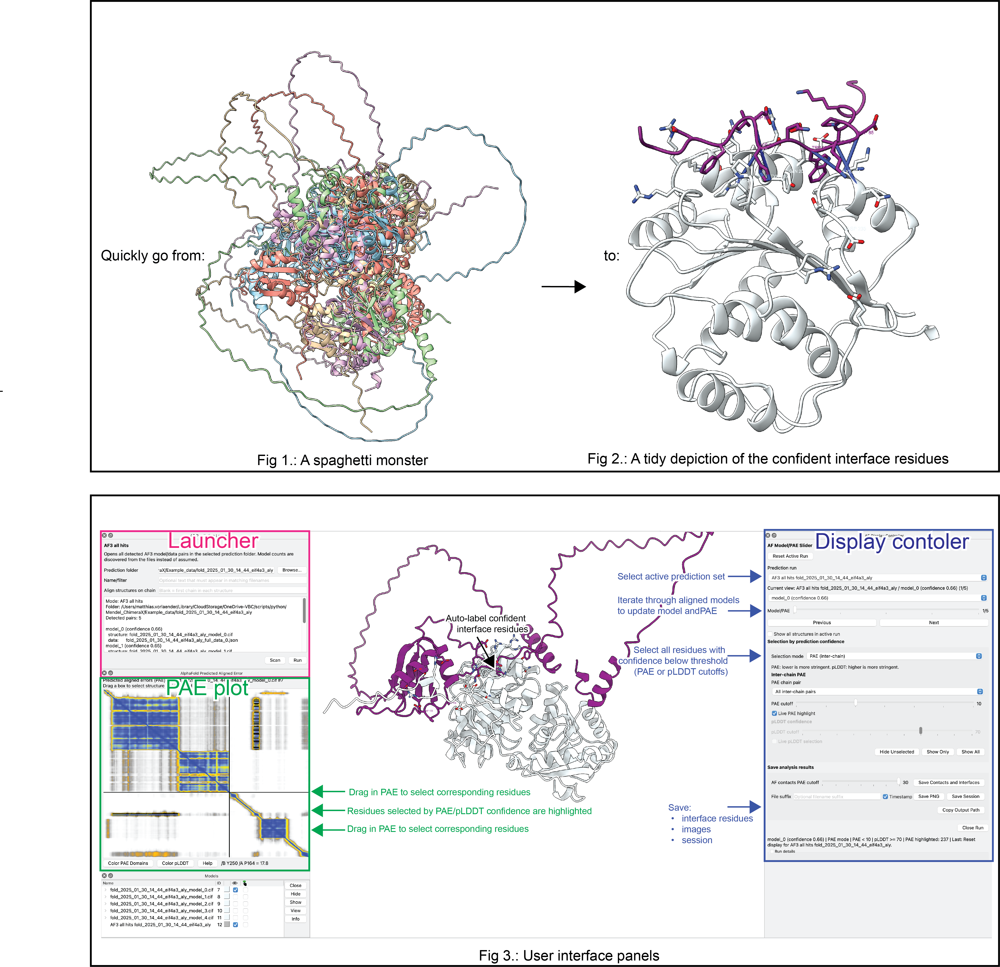

# ChimeraX AF Prediction Toolbars


## Quickstart


This bundle facilitates the analysis of alphafold (multimer) predictions by processing input folders and automatically associating PAE plots to predicted structures. Selection via numeric cutoffs helps to focus on the confident predictions and avoiding spaghetting monsters

## Installation 
Use one install method only.

### Recommended wheel install:

1. Download the latest `.whl` from the "assets" tab under:
   https://github.com/mvorlander/chimerax-afprediction-toolbars/releases/latest
2. Open ChimeraX.
3. Run this in the ChimeraX command line, replacing the path with your downloaded
   wheel:

```text
toolshed install /path/to/ChimeraX_AFPredictionToolbars-1.3.16-py3-none-any.whl
```

4. Restart ChimeraX.
5. Open the `AF` toolbar tab.

<details>

  <summary>Alternative installation method</summary>

```bash
git clone https://github.com/mvorlander/chimerax-afprediction-toolbars.git
cd chimerax-afprediction-toolbars
python3 install_chimerax_bundle.py
```

Restart ChimeraX after installing from source.

<details>


This bundle adds a small `AF` toolbar tab to ChimeraX with five actions:

- `AF3 All Hits`: opens all detected AF3 `model_N` / `data_N` pairs in a prediction folder.
- `AF3 Top Hit`: opens the best detected AF3 model. Ranking metadata is used when available; otherwise the lowest model number is used.
- `AF2 All Hits`: opens all detected AF2 ranked structure/JSON pairs.
- `AF2 Top Hit`: opens only the best detected AF2 rank, preferring `rank_1`.
- `Missense`: maps AlphaMissense scores from a human UniProt entry onto exactly one selected protein chain.

The workflow is implemented in bundled Python code. It does not call external `.cxc`
scripts and does not contain machine-specific paths.

AF2/AF3 runs open a dedicated `AF Model/PAE Slider` controller. The controller
has a prediction-run drop-down and a pair slider. The drop-down chooses which
folder/run is active, and the slider switches the displayed structure and the
displayed PAE matrix together. Each run uses one PAE plot tool and updates the
plot data when the slider changes. 

For AF3 all-hit runs, the bundle displays metadata-based confidence scores in
the model selector when ranking metadata is available. Models with confidence
scores are ordered from highest to lowest score in the slider.

When several models are opened from one prediction run, the bundle aligns them
to the first opened model and adds them to one ChimeraX model group in the
Models panel. Starting another AF2/AF3 run keeps the earlier run loaded; use the
controller drop-down to switch which run's models and PAEs are displayed.

The controller also includes a `Selection by prediction confidence` section.
Use the `Selection mode` switch to choose either PAE or pLDDT; PAE is the
default. For multimer contacts, choose `All inter-chain pairs` or a specific
`PAE chain pair`, then use the `PAE cutoff` slider to find residues by their
minimum PAE to the selected partner chain(s). The default threshold is 10, and
lower values are more stringent. Moving the slider live-selects matching
residues. The PAE overlay marks only the below-cutoff inter-chain cells that
caused those residues to pass the filter, rather than full rows and columns.

For monomeric predictions or local chain-confidence filtering, switch to pLDDT
mode and use the `pLDDT cutoff` slider. It selects residues with pLDDT at or
above the cutoff; the default is 70, and higher values are more stringent.

`Hide Unselected` applies the active confidence filter to every model in the
current run, hiding atoms, pseudobonds, cartoons, and surfaces outside the
cutoff while preserving the current display style of matching residues. Bond
display flags are kept normal so later ChimeraX `show` commands do not reveal
isolated atoms. `Show Only` applies the active confidence filter to the current
model only, while `Show All` restores a cartoon-only display for the current
model.

The `PAE chain pair` menu does not change which model is displayed. It only
controls which chain pair is considered by the inter-chain PAE cutoff. For
example, `A-B` highlights residues whose best PAE contact is between chains A
and B. `All inter-chain pairs` means a residue passes if at least one residue in
any other chain is below the cutoff; it does not require every chain pair to
pass. Turn off `Live PAE highlight` to stop live selection and PAE overlays
while still using the cutoff for `Show Only`.

Opening a prediction run prepares ChimeraX contact/interface display for every
model, but does not write contact/interface files to disk. The `Save analysis
results` section contains `Save Contacts and Interfaces` for writing formatted
contact and interface reports for the active model to the active run's output
folder. The `AF contacts PAE cutoff` slider controls how stringent ChimeraX's
`alphafold contacts` command is for that save; lower values keep only more
confident contacts. Rerunning contacts/interfaces removes old AF-contact residue
labels before relabeling the current result. Interface residues are shown as
connected residue sticks on top of the cartoon model.

Use `Save PNG` to save the current 3D view as a transparent-background PNG in
the active run's output folder. Use `Save Session` to save a ChimeraX `.cxs`
session to the same active output folder. The optional `File suffix` field is
appended to the filename for the active model/pair, and the `Timestamp` checkbox
controls whether saved PNG/session filenames include a timestamp.
`Copy Output Path` copies the active output folder to the clipboard. `Close Run`
closes the active run's models and PAE plot without disturbing other loaded
runs. `Reset Active Run` restores the active run to its initial slider/display
state: first model selected, one model visible, all chain pairs selected, PAE
mode selected, PAE threshold reset to 10, pLDDT cutoff reset to 70, AF contacts
max PAE reset to 30, cartoon-only model display, and prepared contact side
chains shown. Longer active-run path details are kept in the collapsed `Run
details` panel to keep the controller compact.

The missense panel fetches AlphaMissense scores directly for a human UniProt
accession or entry name, associates them with the selected target chain, colors
the chain by the average AlphaMissense score, and closes the temporary score set.


## Expected Input

AF3 folders should contain matching structure and data files with model numbers in
their names, for example:

```text
fold_job_model_0.cif
fold_job_full_data_0.json
fold_job_model_1.cif
fold_job_full_data_1.json
```

AF2 folders commonly contain `pdb/` and `json/` subfolders with matching rank
numbers, for example:

```text
pdb/job_rank_1_model_3.pdb
json/job_rank_1_model_3.json
pdb/job_rank_2_model_1.pdb
json/job_rank_2_model_1.json
```

Use the `Name/filter` field when a folder contains outputs for more than one
prediction. The bundle refuses ambiguous matches and shows the candidate files so
the filter can be narrowed.

## Output

When you click `Save Contacts and Interfaces`, generated contact and interface
files are written under:

```text
<prediction folder>/analysis/<filter-or-folder-name>/<mode>/
```

Formatted reports stay directly in that folder. Raw ChimeraX command output is
kept separately under `raw/af_contacts/` and `raw/interface_residues/`. Contact
reports record the `AF contacts max PAE` threshold used for that rerun.

Saved PNG and ChimeraX session files are also written to the active mode folder.
Their filenames include timestamps only when the display controller's
`Timestamp` checkbox is enabled.

Every run also writes:

```text
analysis_summary.json   
analysis_summary.txt
```

These summaries record the bundle version, input folder, active mode, selected
filter, alignment/contact-chain choice, and opened model/data pairs.

The `Align structures on chain` field is optional. If left blank, the first
chain detected in each opened structure is used for alignment and contact
analysis.

## Compatibility Automation

The repository has a monthly GitHub Actions workflow that checks the official
ChimeraX pages for a newer production release. On each run it:

- detects the latest ChimeraX production version,
- compares it with `.github/chimerax_compatibility.json`,
- runs the bundle syntax check and AF2/AF3 discovery smoke test,
- opens a GitHub issue when a newer ChimeraX production release needs manual
  validation.

After validating a new ChimeraX release, update
`.github/chimerax_compatibility.json` so future monthly checks know that version
has been tested.
